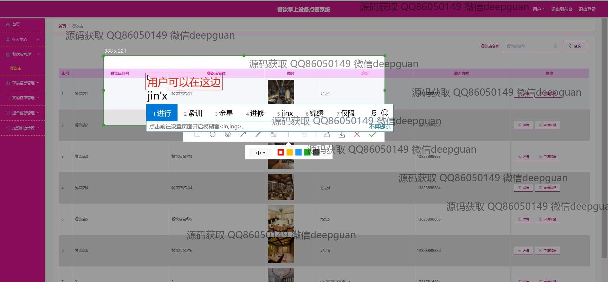
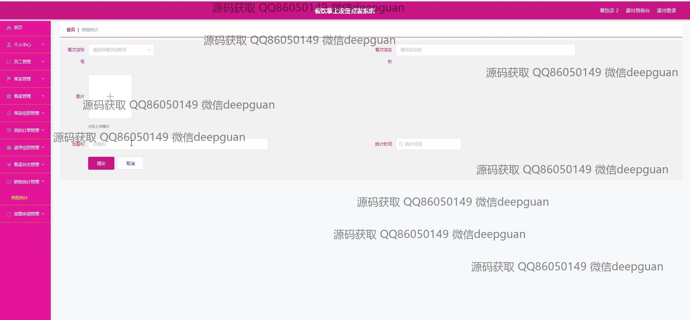
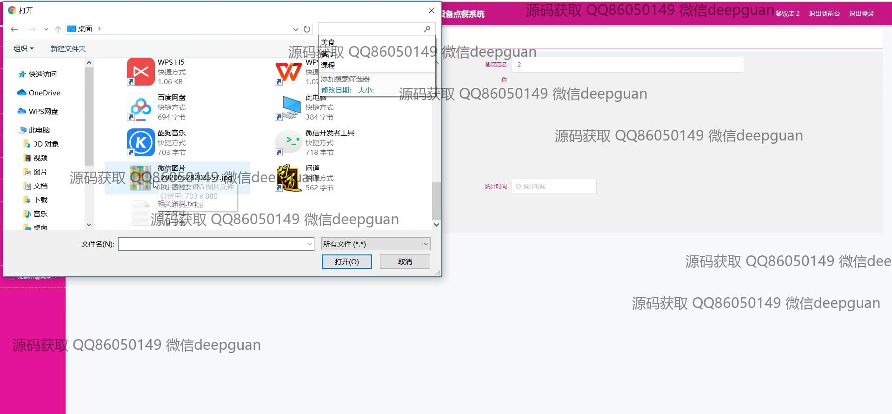
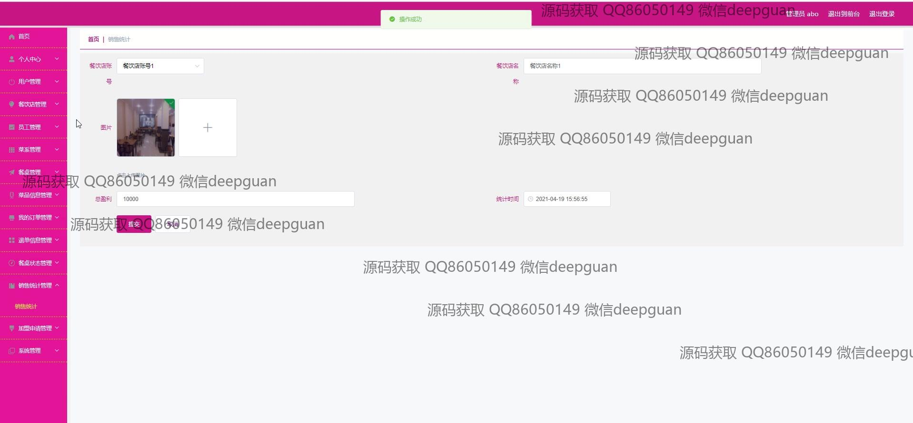

<h1 align="center">餐饮掌上设备点餐系统+vue</h1>

## 简介
餐饮掌上设备点餐系统：角色分为管理员、用户；功能包括个人中心、菜品管理、订单管理、员工管理、销售统计、餐桌状态管理、轮播图管理等。    --计算机毕业设计源码；毕设源码；java毕业设计源码

## 联系方式

<h3 align="center">获取完整代码与数据库文件 + 微信：deepguan QQ: 86050149 QQ群: 783742310</h3>

<h3 align="center">可帮忙远程部署 包运行成功！提供远程部署、修改代码、设计文档指导、代码讲解等服务！</h3>

## 功能介绍（完整见运行截图）
管理员：管理员可以执行用户和员工的管理，包括添加、编辑和删除用户信息、菜品信息、餐饮店详情及审核订单状态。管理员可以通过销售统计页面查看并分析餐饮店的销售数据，还可以管理系统设置以及后台配置，优化平台运营效率。

用户：用户能够注册、登录并修改个人信息，浏览菜品信息，查看和编辑购物车内容，进行在线点餐及支付。用户还可以查看订单记录并查询订单状态，支持多种操作如订单查看、修改和退单处理，提供便捷的餐饮体验。

加盟商：加盟商有权限管理餐饮店信息，包括填写和修改店铺资料、上传图片和查看加盟申请状态。还可以通过系统查看订单数据和销售统计，进行财务对账和管理，确保加盟店的高效运营。

员工：员工能通过系统执行订单管理、菜品信息编辑、餐桌状态更新以及销售数据输入等任务，利用系统功能进行日常餐饮服务及后台辅助管理，提高服务效率及顾客满意度。

## 运行截图

本代码来源于网络,仅供学习参考使用!

